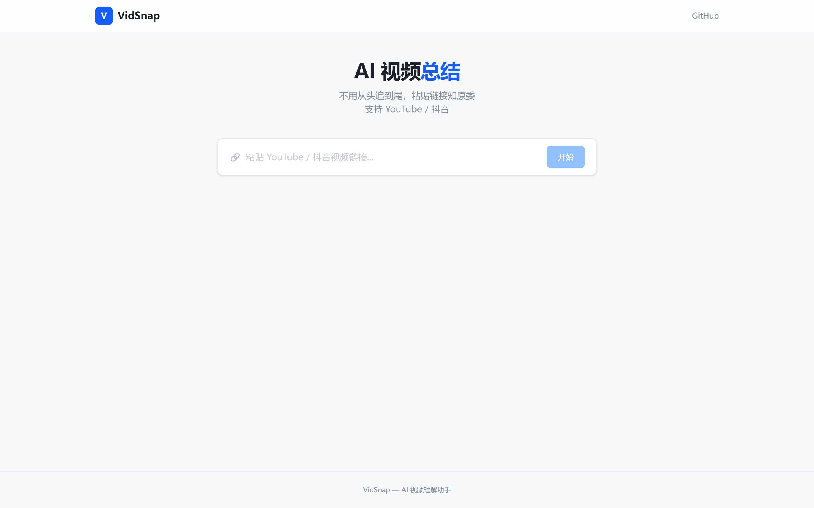
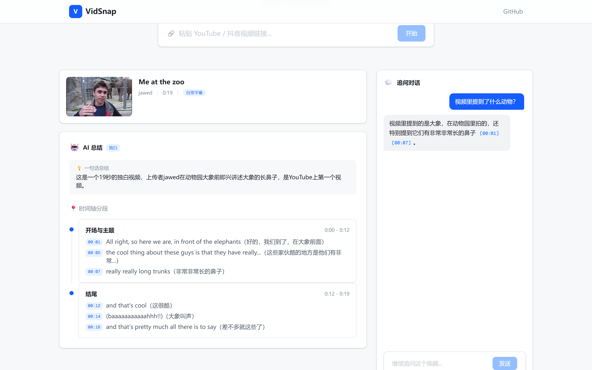
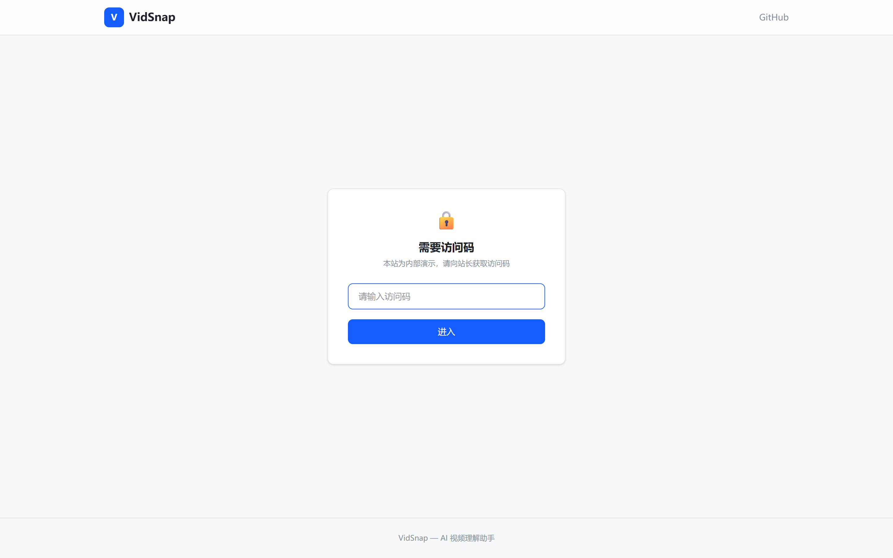
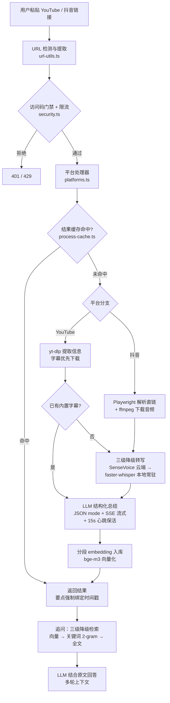

# VidSnap — AI 视频理解助手

> **一句话**：丢给它一个 YouTube / 抖音链接，AI 替你看完，然后你可以问任何问题。

独立从 0 到 1 构建的 AI 视频理解应用，打通「链接解析 → 音视频下载 → 三级降级转写 → LLM 结构化总结 → 向量 RAG 追问」全链路。

## 演示

| 首页 | 处理结果（真实视频） | 追问对话 |
|------|------|------|
|  |  |  |

访问码门禁（公开部署的安全设计）：



> 在线 Demo：<https://vidsnap.amorsum.top>（需访问码，本地运行 + Cloudflare 隧道，电脑在线时可用）

## 功能特性

| 功能 | 说明 |
|------|------|
| 一键视频总结 | 粘贴链接 → 自动下载 → 转写 → 输出结构化摘要（一句话总结 + 分段要点 + 时间戳） |
| 追问对话（RAG） | 基于视频原文提问，向量检索相关片段，回答可溯源到秒级时间戳 |
| 跨语言理解 | 英/日/韩等外语视频自动输出中文总结 |
| 双平台 | YouTube（yt-dlp + 字幕优先）+ 抖音（Playwright 解析 + ffmpeg 下载） |

## 系统架构



## AI 工程亮点

> 本项目的核心不是"能跑"，而是「把 LLM 从能跑做成可信、可控、可评估、可观测」。以下每一点都可以在面试中展开。

1. **三级降级转写**（成本/延迟/可用性权衡）：视频自带字幕 → 硅基流动 SenseVoice 云端 API → 本地 faster-whisper 常驻服务器。Whisper 常驻进程 + stdin/stdout 多行 JSON 协议，消除每次 2-5s 模型冷启动；短视频自动切 tiny 模型提速
2. **向量 RAG 追问**：字幕分段用 bge-m3 向量化（4000 字符截断 + 32 条分批防超长 500），余弦相似度 top-k 检索；embedding 失败自动降级中文 2-gram 关键词检索，再降级全文兜底；回答可溯源到秒级时间戳
3. **结构化输出**：JSON mode（`response_format: json_object`）替代手写 JSON 补丁解析，删掉 60 行脆弱代码，保证 schema 可靠
4. **评测体系（Eval）**：LLM-as-judge 量化总结质量——要点级幻觉率 0%、参考要点召回率 100%（2 条评测集，持续扩充）；评测脚本复用生产 prompt，零漂移
5. **成本可观测**：全链路 token 用量 + 成本埋点（区分缓存命中/未命中单价），单视频成本可量化到分——实测 **¥0.0064 / 1769 tokens / 25.7s**
6. **LLM Provider 抽象层**：DeepSeek（默认）/ Claude 一键切换（两套 API 格式归一），SSE 流式输出 + 15s 心跳解决 Cloudflare 隧道 100s 超时断连
7. **防幻觉设计**：每个要点强制绑定时间戳与原文依据，摘要结论可验证
8. **平台处理器模式**：统一 `getInfo/download` 接口，主流程零 if/else 分平台，扩展新平台只需注册一个处理器

## 质量与成本数据

### 总结质量评测（LLM-as-judge）

运行：`npx tsx scripts/eval/summarize-eval.ts`

| 指标 | 结果 |
|------|------|
| 要点级幻觉率 | 0% |
| 参考要点召回率 | 100% |

### 单视频实测成本（DeepSeek）

| 指标 | 数值 |
|------|------|
| 总耗时（含下载/转写/总结） | 25.7s |
| 缓存命中重复请求 | ~3s |
| LLM tokens | 1769 |
| LLM 成本 | ¥0.0064 |

## 安全

- **访问码门禁**：`ACCESS_CODE` 环境变量 + 前端门禁页（`/api/verify` 校验，暴力猜测有失败计数限流）
- **每 IP 滑动窗口限流**：`/api/process` 10 次/10 分钟，`/api/followup` 30 次/10 分钟，防刷爆 API Key
- **真实 IP 识别**：经 Cloudflare 隧道时读 `cf-connecting-ip` 转发头，不误伤本机回环
- **临时文件清理**：成功/异常分支均清理，无磁盘泄漏

## 测试

项目内置 `test-suite` 技能 + tester 测试专员（Claude Code 自动化测试工作流），最新一轮 **30/30 全通过**（2 项环境相关不计失败），详见 [docs/test-reports/TEST-20260830.md](docs/test-reports/TEST-20260830.md)。

## AI 协作开发

本项目全程与 AI 结对开发（TRAE 起步 → Claude Code 多智能体工作流），并沉淀了一套可复用的多智能体协作体系（3 个专职 agent + 4 个 skill + 自动进度文档化），详见 [docs/AI_CODING.md](docs/AI_CODING.md)。

## 技术栈

- **前端**：Next.js 16 + React 19 + TypeScript + Tailwind CSS v4
- **视频处理**：yt-dlp（YouTube）、Playwright + ffmpeg（抖音，绕过 X-Bogus 签名）
- **ASR 转写**：硅基流动 SenseVoice API（云端）/ faster-whisper（本地降级，CUDA 加速）
- **AI 引擎**：DeepSeek API（默认）/ Claude API（可切换），SSE 流式输出
- **向量检索**：硅基流动 bge-m3 embedding + 余弦相似度检索
- **部署**：本地生产模式 + Cloudflare Tunnel（`vidsnap.amorsum.top`）

## 快速开始

```bash
# 安装依赖
npm install

# 配置环境变量（复制 .env.example 为 .env.local 并填入 Key）
# DEEPSEEK_API_KEY=sk-xxx       # 必填，LLM 总结
# SENSEVOICE_API_KEY=sk-xxx     # 可选，云端转写 + embedding
# ACCESS_CODE=your-code         # 可选，访问码门禁

# 本地启动
npm run dev
```

外部依赖：yt-dlp（PATH 中或项目根目录）、FFmpeg、Python 3.12+（本地 Whisper 降级用，`pip install faster-whisper`）。

## 部署（Cloudflare Tunnel）

`cloudflared.exe` 客户端**不随仓库分发**（二进制约 54MB），需自行下载：

1. 从 [Cloudflare 官方下载页](https://developers.cloudflare.com/cloudflare-one/connections/connect-networks/downloads/) 下载对应平台的 `cloudflared`，放至项目根目录
2. 复制 `cloudflared-config.example.yml` 为 `cloudflared-config.yml`，按注释填入隧道凭据
3. 运行 `start.bat` 一键启动（服务 + 隧道）；如需开机自启，配置 `autostart.bat`（Windows 启动文件夹 + VBS 静默运行）

## 目录结构

```
├── README.md                    # 项目简介
├── PRODUCT_PLAN.md              # 完整产品方案
├── docs/
│   ├── CONTEXT.md               # AI 助手项目上下文
│   ├── AI_CODING.md             # AI 协作开发工作流（多智能体体系）
│   ├── IMPROVEMENT_PLAN.md      # 改进方案与执行进展
│   ├── screenshots/             # 演示截图
│   └── test-reports/            # 自动化测试报告
├── .claude/                     # Claude Code 多智能体工作流
│   ├── agents/                  # 3 个专职 agent（提交/规范/测试）
│   ├── skills/                  # 4 个可复用 skill
│   └── hooks/                   # Stop 钩子 + 进度指纹
├── src/
│   ├── app/
│   │   ├── page.tsx             # 产品首页
│   │   └── api/
│   │       ├── process/         # 视频处理管线（SSE 流式）
│   │       ├── followup/        # RAG 追问
│   │       └── verify/          # 访问码校验
│   ├── components/              # UI 组件
│   └── lib/
│       ├── llm.ts               # LLM Provider 抽象（DeepSeek/Claude）
│       ├── rag.ts               # 向量/关键词检索
│       ├── embeddings.ts        # bge-m3 embedding 封装
│       ├── observability.ts     # token 用量 + 成本核算
│       ├── security.ts          # 访问码 + 滑动窗口限流
│       ├── platforms.ts         # 平台处理器注册
│       ├── transcriber.ts       # 转写调度（三级降级）
│       ├── sensevoice.ts        # SenseVoice 云端 API
│       ├── video-processor.ts   # yt-dlp 视频处理
│       ├── douyin-processor.ts  # 抖音解析（Playwright）
│       ├── prompts.ts           # Prompt 模板
│       ├── process-cache.ts     # 结果缓存（1h 过期）
│       ├── transcript-store.ts  # 原文 + embedding 存储（追问用）
│       ├── conversation-store.ts# 多轮对话历史
│       └── url-utils.ts         # URL 解析与平台检测
└── scripts/
    ├── whisper_server.py        # Whisper 常驻服务器（消冷启动）
    ├── whisper_asr.py           # Whisper 降级脚本
    ├── douyin_playwright.py     # 抖音 Playwright 解析
    └── eval/                    # 总结质量评测（LLM-as-judge）
```

## 路线图

- [x] 核心链路 + 双平台 + RAG 追问
- [x] 结构化输出 + 评测集 + 成本可观测
- [x] 鉴权限流 + 自动化测试体系（30/30）
- [ ] 关键帧视觉理解（音视频多模态）
- [ ] 追问 Agent 化（tool-calling 自主决策）
- [ ] 异步任务队列 + 持久化向量库
- [ ] 云端容器化部署（24/7 在线）
