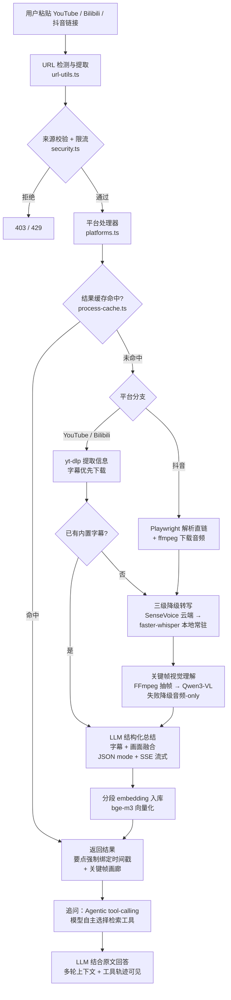

# VidSnap — AI 视频理解助手

> **一句话**：丢给它一个 YouTube / Bilibili / 抖音链接，AI 替你看完，然后你可以问任何问题。

独立从 0 到 1 构建的 AI 视频理解应用，打通「链接解析 → 音视频下载 → 三级降级转写 → 关键帧视觉理解 → LLM 结构化总结 → Agentic RAG 追问」全链路，支持 YouTube / Bilibili / 抖音三平台。

开发分支：按 2026-10-26 的最新约定，后续开发、提交和推送统一使用 `main`；此前 `demo` 的开发历史已快进整合到 `main`。

> **阶段进展（2026-10-30）**：第一阶段 [学习闭环](docs/LEARNING_WORKSPACE.md) 与 N0 自动检查已完成。N1 保留隔离存储原型，按用户要求暂缓数据库配置，先推进 N3 检索与引用检查；最新离线回归 325 项通过，见 [引用检查报告](docs/test-reports/TEST-20261030-CITATION-AUDIT.md)。持久化、可靠任务恢复、真实内容质量、稳定部署及账号同步仍按 [优化计划](docs/NEXT_PHASE_PLAN.md) 分步实施。
>
> 真实短样本与约 41 分钟 B 站文字链路的范围见 [长视频说明](docs/LONG_VIDEO.md) 和 [流水线计时](docs/PIPELINE_TIMING.md)，不能外推总体延迟、学习质量或真实视觉覆盖率。抖音登录、完整视觉、多语言及真实复习题质量仍待补齐。当前依赖个人电脑在线，会话/分析仍在内存，重启丢在线追问资格；云端时间戳为估算，主总结的 Claude 流式切换尚不完整。CI 已实施，数据库适配器仍是隔离原型，尚未接入应用；Worker 和账号尚未交付。

## 演示

当前无门禁三平台入口（2026-10-28）：[桌面截图](docs/screenshots/bilibili-home-desktop.png) · [手机截图](docs/screenshots/bilibili-home-mobile.png)。

笔记备份与恢复（隔离测试数据，2026-10-29）：[桌面截图](docs/screenshots/notebook-backup-desktop.png) · [手机截图](docs/screenshots/notebook-backup-mobile.png)。

章节进度与复习（隔离测试数据，2026-10-29）：[桌面截图](docs/screenshots/learning-progress-desktop.png) · [手机截图](docs/screenshots/learning-progress-mobile.png)。

笔记全文搜索（隔离测试数据，2026-10-29）：[桌面截图](docs/screenshots/notebook-search-desktop.png) · [手机截图](docs/screenshots/notebook-search-mobile.png)。

以下为早期演示截图；新工作台的交互与验证范围见 [学习闭环说明](docs/LEARNING_WORKSPACE.md)。

学习辅助界面（隔离测试数据）：[桌面截图](docs/screenshots/study-desktop.png) · [手机截图](docs/screenshots/study-mobile.png)。

连接恢复界面（隔离测试数据）：[手机截图](docs/screenshots/recovery-mobile.png)。

| 首页 | 视频理解工作台 | 移动端 |
|------|------|------|
|  |  |  |

> 在线 Demo：<https://vidsnap.amorsum.top>（本地运行 + Cloudflare 隧道，电脑在线时可用）

## 功能特性

2026-10-30 新增离线 [总结时间引用检查](docs/CITATION_AUDIT.md)：`npm run check:citations -- <JSON文件>` 可检查分析结果或笔记备份中的时间格式、视频/章节越界及证据空档，不联网、不修改笔记；时间匹配不代表事实正确。

2026-10-30 追问的关键词降级支持日文假名、韩文、单个数字和全角字母数字，避免跨标点拼接词语及数字误命中更长数字；仅在模型使用关键词检索时生效，不代表多语言转写或语义理解已通过真实视频评测。详见 [检索验证](docs/test-reports/TEST-20261030-RAG-QUALITY.md)。

2026-10-29 笔记库新增本地全文搜索：可检索标题、总结、字幕、个人笔记、摘录和成功问答，显示来源与命中片段，点击可定位原文时间、个人笔记或对应对话。支持与学习状态组合筛选，搜索不调用模型、不上传搜索词，详见 [全文搜索说明](docs/LEARNING_WORKSPACE.md#笔记库全文搜索)。

2026-10-29 新增章节学习进度与手动复习记录：逐章勾选、按待学习／学习中／已学完筛选笔记，记录复习次数和最近日期。支持本地保存、JSON 备份恢复及 Markdown 导出；不依赖在线追问资格。详见 [学习记录说明](docs/LEARNING_WORKSPACE.md#学习进度与复习记录)。

2026-10-29 笔记库支持 JSON 备份与导入，可在另一浏览器恢复字幕、总结、个人笔记、摘录和问答。导入前预览，相同内容跳过，冲突保留副本，写入失败整批回滚；文件仅在浏览器内处理，不恢复服务器追问资格。单文件最多 20 MiB / 500 篇，详见 [备份说明](docs/LEARNING_WORKSPACE.md#笔记备份与导入)。

2026-10-28 长视频转写增加分段处理：超过 5 分钟或音频超过 40 MiB 时按音频实际时长切成最多 5 分钟的片段，云端失败后对当前及后续片段降级本地 Whisper。云端时间仍为片段内估算；不保证精确对齐。真实短视频与约 41 分钟 B 站视频的文字链路验证及限制见 [长视频处理说明](docs/LONG_VIDEO.md)。

2026-10-28 新增 Bilibili 视频支持并移除访问码。支持 BV/av、分享短链、指定分 P 的总结、原文、追问和笔记；一个链接只分析一个分 P。字幕不可用时走现有云端／本地转写，番剧、直播、收藏夹与整合集批量分析暂不支持。公开视频可匿名下载，需要平台登录的视频或字幕仍依赖服务器 `cookies.txt` 中的有效 B 站登录态。详见 [本轮验证](docs/test-reports/TEST-20261028-BILIBILI.md)。

分析中刷新页面后会尝试找回已有任务；连接中断时提供“恢复分析连接”。恢复不会启动新的模型处理，服务器重启后需重新分析，详见 [恢复范围](docs/LEARNING_WORKSPACE.md#刷新与连接恢复)。本批 254 项自动测试、31 组隔离浏览器检查及静态/构建检查通过，见 [验证报告](docs/test-reports/TEST-20261026-RECOVERY.md)。学习辅助上一批已由 `8c3ce28` 推送 `demo`。

学习辅助已加入工作台：术语解释、先出题再按需查看参考答案、字幕/总结/问答重点摘录。摘录随本地笔记保存和 Markdown 导出，兼容已有笔记；详见 [使用说明](docs/LEARNING_WORKSPACE.md) 与 [本轮验证](docs/test-reports/TEST-20261026-STUDY-TOOLS.md)。上一批学习闭环与处理稳定性已由 `45b88d3` 推送至 `demo`。

2026-10-26 新增 [单视频学习工作台](docs/LEARNING_WORKSPACE.md)：总结／字幕原文／追问联动、关键词搜索、章节解释、IndexedDB 本地笔记、个人笔记和 Markdown 导出。文本保存在当前浏览器，清除网站数据后会丢失；不长期保存帧图片，在线追问仍受服务器 1 小时保留期限制。处理失败保留已有笔记，生成期间不展示原始 JSON。本轮检查见 [学习工作台测试报告](docs/test-reports/TEST-20261026-LEARNING.md)；此前暂缓的真实平台验收仍待补齐。

| 功能 | 说明 |
|------|------|
| 现代响应式工作台 | 聚焦链接输入、处理进度、关键帧画廊、时间线总结与 Video Agent 的一体化布局，兼顾桌面端与移动端体验 |
| 一键视频总结 | 粘贴链接 → 自动下载 → 转写 → 输出结构化摘要（一句话总结 + 分段要点 + 时间戳） |
| 关键帧视觉理解（多模态） | FFmpeg 均匀采样抽帧 → Qwen3-VL 视觉模型逐帧描述 → 与字幕按时间戳融合进总结，关键帧画廊可点击跳转分段 |
| 追问对话（Agentic RAG） | 模型自主决策检索策略（语义/关键词/时间范围三工具 tool-calling），回答可溯源到秒级时间戳，前端可见工具调用轨迹 |
| 跨语言理解 | 英/日/韩等外语视频自动输出中文总结 |
| 三平台 | YouTube / Bilibili（yt-dlp + 字幕优先）+ 抖音（Playwright 解析 + ffmpeg 下载） |

## 系统架构


```mermaid
flowchart TD
    A[用户粘贴 YouTube / Bilibili / 抖音链接] --> B[URL 检测与提取<br/>url-utils.ts]
    B --> C{来源校验 + 限流<br/>security.ts}
    C -->|拒绝| C1[403 / 429]
    C -->|通过| D[平台处理器<br/>platforms.ts]
    D --> E{结果缓存命中?<br/>process-cache.ts}
    E -->|命中| P[直接返回<br/>实测 11s → 3s]
    E -->|未命中| F{平台分支}
    F -->|YouTube / Bilibili| G[yt-dlp 提取信息<br/>字幕优先下载]
    F -->|抖音| H[Playwright 解析直链<br/>+ ffmpeg 下载音频]
    G --> I{已有内置字幕?}
    I -->|是| K
    I -->|否| J[三级降级转写<br/>SenseVoice 云端 →<br/>faster-whisper 本地常驻]
    H --> J
    J --> V[关键帧视觉理解<br/>FFmpeg 抽帧 → Qwen3-VL<br/>失败降级音频-only]
    V --> K[LLM 结构化总结<br/>字幕 + 画面融合<br/>JSON mode + SSE 流式]
    K --> L[分段 embedding 入库<br/>bge-m3 向量化]
    L --> P[返回结果<br/>要点强制绑定时间戳<br/>+ 关键帧画廊]
    P --> Q[追问：Agentic tool-calling<br/>模型自主选择检索工具]
    Q --> R[LLM 结合原文回答<br/>多轮上下文 + 工具轨迹可见]
```

## AI 工程亮点

> 本项目的核心不是"能跑"，而是「把 LLM 从能跑做成可信、可控、可评估、可观测」。以下每一点都可以在面试中展开。

1. **三级降级转写**（成本/延迟/可用性权衡）：视频自带字幕 → 硅基流动 SenseVoice 云端 API → 本地 faster-whisper 常驻服务器。单 Node 进程共享串行转写队列，握手和请求 ID 隔离响应；排队、启动、推理与脚本兜底共用默认 10 分钟预算。保留既有短抖音 tiny 策略，本批没有质量或提速实测结论
2. **多模态关键帧视觉理解**：FFmpeg 均匀采样抽帧（确定性时间戳）→ 硅基流动 Qwen3-VL 批量画面描述 → 与字幕按时间戳融合进总结（画面与字幕冲突时以画面为准，±5s 容差语义对齐）；视觉链路任何失败静默降级音频-only；关键帧画廊 + HMAC 签名帧图服务 + 2h 生命周期管理
3. **Agentic 追问（tool-calling）**：检索策略从固定管线升级为模型自主决策——语义检索/关键词检索/时间范围三工具，DeepSeek function calling 与 Claude tool_use 双协议归一；轮数上限 + 重复调用终止 + 无工具终轮三重防死循环；前端可见工具调用轨迹
4. **向量 RAG**：字幕分段 bge-m3 向量化（4000 字符截断 + 32 条分批防超长 500），余弦相似度 top-k；回答可溯源到秒级时间戳
5. **结构化输出**：JSON mode（`response_format: json_object`）替代手写 JSON 补丁解析，删掉 60 行脆弱代码，保证 schema 可靠
6. **评测体系（Eval）**：LLM-as-judge 量化总结质量——要点级幻觉率 0.0%、参考要点召回率 99.1%（12 条评测集：教程/评测/新闻/访谈/演讲 × 中/英/日多语言，含 1 条真实 YouTube 视频）；评测脚本复用生产 prompt，零漂移，结果 JSON 归档可追溯
7. **成本可观测**：全链路 token 用量 + 成本埋点（区分缓存命中/未命中单价、视觉模型独立计价），单视频成本可量化到分——实测 **¥0.0064 / 1769 tokens / 25.7s**（不含视觉：视觉单次 902 tokens ≈ ¥0.0017）
8. **LLM Provider 抽象层**：DeepSeek（默认）/ Claude 一键切换（两套 API 格式归一），SSE 流式输出 + 15s 心跳解决 Cloudflare 隧道 100s 超时断连
9. **防幻觉设计**：每个要点强制绑定时间戳与原文依据，摘要结论可验证
10. **平台处理器模式**：统一 `getInfo/download` 接口，主流程零 if/else 分平台，扩展新平台只需注册一个处理器

## 质量与成本数据

### 总结质量评测（LLM-as-judge）

运行：`npx tsx scripts/eval/summarize-eval.ts`（`--only <id>` 跑子集；结果归档 `scripts/eval/results/`）

| 指标 | 结果 |
|------|------|
| 评测集规模 | 12 条（教程/评测/新闻/访谈/演讲 × 中/英/日，含 1 条真实 YouTube 视频） |
| 要点级幻觉率 | 0.0%（139 个要点，0 幻觉） |
| 参考要点召回率 | 99.1%（106 个参考要点覆盖 105 个） |

### 单视频实测成本（DeepSeek）

| 指标 | 数值 |
|------|------|
| 总耗时（含下载/转写/总结） | 25.7s |
| 缓存命中重复请求 | ~3s |
| LLM tokens | 1769 |
| LLM 成本 | ¥0.0064 |

## 安全

- **直接使用**：已移除访问码页面和校验，旧 `ACCESS_CODE` 配置不再生效；账号登录、用户额度与跨设备同步后续补齐
- **每 IP 滑动窗口限流**：`/api/process` 10 次/10 分钟，`/api/followup` 30 次/10 分钟，防刷爆 API Key
- **代理 IP 读取**：优先读取 `cf-connecting-ip`；只有源站入口受控且代理覆写头时才可信
- **会话隔离**：HttpOnly 匿名会话绑定分析 ID；结果、字幕、对话、帧图和删除均校验归属，写接口增加来源与 JSON 内容类型校验
- **媒体出站校验**：短链逐跳验证；yt-dlp、浏览器与直链下载限制平台/CDN 域名和公网 DNS，连接固定已验证 IP；FFmpeg 仅处理本地输入。应用边界不替代系统级出站策略
- **临时文件清理**：主处理使用独立分析目录；成功清媒体、异常/删除清本分析，帧有独立到期清理，不按平台 ID 前缀删除共享文件。进程崩溃后的扫尾仍依赖后续分析触发

## 测试

`npm run test:security` 覆盖接口保护、会话隔离、删除竞态、期限与独立产物目录，使用模拟媒体/模型和真实文件清理；长音频分段回归使用本机 FFmpeg/FFprobe 处理合成音频，不发生付费调用。历史完整流水线测试为 44 条用例 43 通过 / 1 环境相关，见 [历史报告](docs/test-reports/TEST-20260831.md)，不代替当前回归结果。

## AI 协作开发

本项目全程与 AI 结对开发（TRAE 起步 → Claude Code 多智能体工作流），并沉淀了一套可复用的多智能体协作体系（3 个专职 agent + 3 个 skill + 自动进度文档化），详见 [docs/AI_CODING.md](docs/AI_CODING.md)。

## 技术栈

- **前端**：Next.js 16 + React 19 + TypeScript + Tailwind CSS v4
- **视频处理**：yt-dlp（YouTube / Bilibili）、Playwright + ffmpeg（抖音，绕过 X-Bogus 签名）
- **ASR 转写**：硅基流动 SenseVoice API（云端）/ faster-whisper（本地降级，CUDA 加速）
- **视觉理解**：FFmpeg 关键帧抽取 + 硅基流动 Qwen3-VL-32B（OpenAI 兼容接口，批量多图描述）
- **AI 引擎**：DeepSeek API（默认）/ Claude API（可切换），SSE 流式输出，tool-calling 双协议归一
- **向量检索**：硅基流动 bge-m3 embedding + 余弦相似度检索
- **部署**：本地生产模式 + Cloudflare Tunnel（`vidsnap.amorsum.top`）

## 快速开始

```bash
# 安装依赖
npm install

# 配置环境变量（复制 .env.example 为 .env.local 并填入 Key）
# DEEPSEEK_API_KEY=sk-xxx       # 必填，LLM 总结
# SENSEVOICE_API_KEY=sk-xxx     # 可选，云端转写 + embedding + 关键帧视觉理解（一 key 三用）
# VISION_ENABLED=0              # 可选，显式关闭视觉理解（默认有 key 即启用）

# 本地启动
npm run dev
```

外部依赖：yt-dlp（PATH 中）、FFmpeg、Python 3.12+（媒体网络边界及抖音解析需要；本地 Whisper 降级另需 `pip install faster-whisper`）。

Bilibili 部分媒体 CDN 使用 HTTPS 8082 端口；该端口仅对 `*.mcdn.bilivideo.cn` 放行，仍校验公网 DNS 与连接目标。

本机代理将域名解析为 fake-IP 而导致下载被拒绝时，可在 `.env.local` 设置 `MEDIA_DNS_MODE=doh`，让 VidSnap 使用独立加密 DNS；域名和公网地址校验仍保留，详见 [媒体网络说明](docs/MEDIA_NETWORK.md#本机代理返回-fake-ip-时)。

媒体出站默认直连，不自动使用系统/环境代理或 yt-dlp 本地配置。需要代理时在 `.env.local` 配置 `MEDIA_UPSTREAM_PROXY=http://127.0.0.1:<HTTP或mixed端口>`，并保证 DNS 返回真实公网地址；迁移限制及完整规则见 [媒体网络说明](docs/MEDIA_NETWORK.md)。

本地转写可配置 `WHISPER_TIMEOUT_MS`（默认 600000）和 `WHISPER_STARTUP_TIMEOUT_MS`（默认 120000）；队列满/超时明确失败，不并行启动脚本绕过限制。配置、协议兼容和恢复边界见 [Whisper 恢复说明](docs/WHISPER_RECOVERY.md)。

## 开发与验证

N0 已完成：Windows CI 已通过 lint、类型、自动回归、构建和隔离浏览器检查；`npm run check:browser` 在独立副本运行三组浏览器回归，发布步骤见 [发布与回滚检查清单](docs/RELEASE_CHECKLIST.md)。N1 存储适配器原型正在隔离 PostgreSQL 中测试，尚未接入应用，生产仍为内存存储。`npm run test:persistence` 仅在显式设置本机测试数据库及确认变量时执行，详见 [验证报告](docs/test-reports/TEST-20261029-N0-N1.md)。

日常开发、提交和推送统一使用 `main`；按用户明确授权提交发布。`demo` 和 `master` 保留历史，B 站接入已参考 `master` 旧实现并适配当前三平台架构，未整体合入旧版。

```bash
npm run lint
npx tsc --noEmit
npm run test:security
npm run check:runtime
npm run build
```

`test:security` 使用独立测试进程、限流桶、模拟媒体/模型响应和真实临时目录，覆盖接口保护、输入边界与历史接口文件清理；长音频测试使用本机 FFmpeg/FFprobe 和合成音频，不需要真实密钥或付费调用。当前未提供 `npm test`。已有生产服务运行时，在独立项目副本执行构建，避免改写服务使用的 `.next`。

`check:runtime` 默认不联网、不加载模型或读取 Cookie 内容；`--network` 和 `--whisper-smoke` 显式启用平台连接与缓存 tiny 本地推理。需要媒体代理时可使用 `--proxy http://127.0.0.1:7890` 覆盖本次检查，详见 [环境检查说明](docs/RUNTIME_CHECKS.md)。字体已随仓库本地提供，正常构建不再依赖 Google Fonts 或字体响应夹具。

`check:media` 验证固定公开短视频的真实媒体环节；`check:pipeline -- --workspace .\tmp\m0-session-validation --proxy http://127.0.0.1:7890 --json` 在独立进程直接调用生产路由，验证文字总结、追问、缓存和删除，不监听端口。后者读取实际配置、使用本次 Cookie 副本并调用真实付费模型，须先按 [验收说明](docs/PIPELINE_TIMING.md) 准备独立副本；不等价于 HTTP/浏览器或完整视觉验收。

接口调用需要保存服务端签发的会话 Cookie；追问与删除应回传 `analysisId` 和 `videoId`。内容默认保留 1 小时，帧默认 2 小时，缓存命中不续期；详见 [匿名会话与分析资源](docs/API_SESSIONS.md)。

视频入口接受 YouTube 的 watch、youtu.be、shorts、embed、v 视频链接，Bilibili 的 `/video/BV…`、`/video/av…`、`b23.tv` 短链（保留 `p` 分 P），以及抖音 `/video/<数字 ID>` 和 `v.douyin.com` 短链接；拒绝用户主页、异常端口、userinfo 和伪造域名。服务端移除分享参数后再处理。主处理及两个历史处理接口共用每 IP 10 次/10 分钟额度；追问与删除各为 30 次/10 分钟，429 返回 `Retry-After`。代理 IP 头仅在受控源站入口和代理覆写条件下可信。

两个历史接口 `/api/process/summarize`、`/api/process/transcribe` 保留现有 JSON 响应；仓库内未发现调用方，先做兼容保护，后续再明确停用策略。主接口仍使用原 SSE 协议。

## 部署（Cloudflare Tunnel）

`cloudflared.exe` 客户端**不随仓库分发**（二进制约 54MB），需自行下载：

1. 从 [Cloudflare 官方下载页](https://developers.cloudflare.com/cloudflare-one/connections/connect-networks/downloads/) 下载对应平台的 `cloudflared`，放至项目根目录
2. 复制 `cloudflared-config.example.yml` 为 `cloudflared-config.yml`，按注释填入隧道凭据
3. 运行 `start.bat` 一键启动（服务 + 隧道）；如需开机自启，配置 `autostart.bat`（Windows 启动文件夹 + VBS 静默运行）

部署脚本统一使用 `http://127.0.0.1:3100`，避免与其他程序的 3000 端口冲突；已有 `cloudflared-config.yml` 也须将 VidSnap 的 `service` 改为此地址。`npm run dev` 的默认开发端口仍为 3000。两个批处理共用 `scripts/start-services.ps1`，仅在首页返回成功且标题为 VidSnap 时复用服务；端口被其他程序占用或启动失败时会报错，不会停止占用者或继续启动隧道。重复运行复用当前项目的隧道进程，启动日志保存在 `tmp/deployment/`。

## 目录结构

```
├── README.md                    # 项目简介
├── PRODUCT_PLAN.md              # 完整产品方案
├── docs/
│   ├── CONTEXT.md               # AI 助手项目上下文
│   ├── AI_CODING.md             # AI 协作开发工作流（多智能体体系）
│   ├── IMPROVEMENT_PLAN.md      # 改进方案与执行进展
│   ├── OPTIMIZATION_PLAN.md     # 分阶段优化方案与 M0 当前进展
│   ├── API_SESSIONS.md          # 匿名会话、分析归属和接口兼容说明
│   ├── screenshots/             # 演示截图
│   └── test-reports/            # 自动化测试报告
├── .claude/                     # Claude Code 多智能体工作流
│   ├── agents/                  # 3 个专职 agent（提交/规范/测试）
│   ├── skills/                  # 3 个可复用 skill（git-push 含文档同步）
│   └── hooks/                   # Stop 钩子 + 进度指纹
├── src/
│   ├── app/
│   │   ├── icon.svg             # 品牌图标与浏览器页签图标
│   │   ├── page.tsx             # 响应式首页与视频理解工作台
│   │   └── api/
│   │       ├── process/         # 视频处理管线（SSE 流式 + 视觉理解阶段）
│   │       ├── followup/        # Agentic 追问（tool-calling）
│   │       ├── frames/          # 关键帧图片服务（HMAC 签名鉴权）
│   │       └── session/         # 匿名会话签发
│   ├── components/              # UI 组件（含 KeyframeGallery 关键帧画廊）
│   └── lib/
│       ├── llm.ts               # LLM Provider 抽象 + tool-calling 循环
│       ├── vision.ts            # Qwen3-VL 视觉理解 + 帧图签名
│       ├── keyframes.ts         # FFmpeg 抽帧 + 帧文件生命周期
│       ├── rag.ts               # 向量/关键词检索
│       ├── embeddings.ts        # bge-m3 embedding 封装
│       ├── observability.ts     # token 用量 + 成本核算（含视觉计价）
│       ├── security.ts          # 来源校验 + 滑动窗口限流
│       ├── request-validation.ts# JSON、视频 ID 和问题的运行时校验
│       ├── media-workspace.ts   # 历史接口独立媒体目录与 finally 清理
│       ├── session.ts           # 服务端匿名会话 Cookie
│       ├── analysis-store.ts    # 分析归属、状态和有效期
│       ├── analysis-artifacts.ts# 独立产物目录、边界验证与到期清理
│       ├── platforms.ts         # 平台处理器注册
│       ├── transcriber.ts       # 转写调度（三级降级）
│       ├── whisper-client.ts    # 共享队列、握手、预算及故障恢复
│       ├── sensevoice.ts        # SenseVoice 云端 API
│       ├── video-processor.ts   # yt-dlp 视频处理
│       ├── douyin-processor.ts  # 抖音解析（Playwright）
│       ├── prompts.ts           # Prompt 模板
│       ├── process-cache.ts     # 结果缓存（1h 过期）
│       ├── transcript-store.ts  # 原文 + embedding 存储（追问用）
│       ├── conversation-store.ts# 多轮对话历史
│       └── url-utils.ts         # URL 解析与平台检测
├── tests/                       # 无付费依赖的安全与历史接口回归
└── scripts/
    ├── whisper_server.py        # Whisper 常驻服务器（消冷启动）
    ├── whisper_asr.py           # Whisper 降级脚本
    ├── whisper_audio.py         # 有界预处理与 WAV 清理
    ├── douyin_playwright.py     # 抖音 Playwright 解析
    └── eval/                    # 总结质量评测（LLM-as-judge，fixtures + results 归档）
```

## 路线图

- [x] 核心链路 + 双平台 + RAG 追问
- [x] 结构化输出 + 评测集 + 成本可观测
- [x] 鉴权限流 + 自动化测试体系（30/30）
- [x] 关键帧视觉理解（音视频多模态，Qwen3-VL + 关键帧画廊）
- [x] 追问 Agent 化（tool-calling 自主决策检索策略）
- [ ] 异步任务队列 + 持久化向量库
- [ ] 云端容器化部署（24/7 在线）
