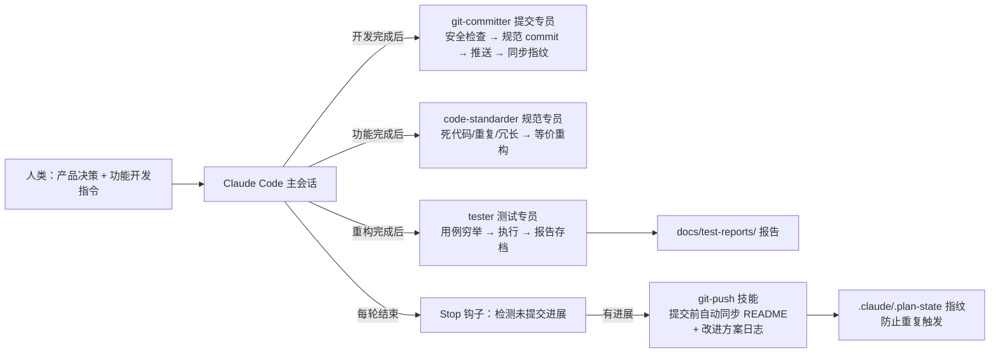

# AI 协作开发工作流 — VidSnap 的多智能体开发体系

> 本文档记录 VidSnap 项目从「人与 AI 结对编程」到「多智能体协作开发」的完整演进，以及沉淀下来的可复用工作流体系。
> 它既是项目的历史记录，也是本人 AI Coding 实践的方法论总结。

---

## 1. 演进历程

| 阶段 | 工具 | 方式 | 产出 |
|------|------|------|------|
| 2026-07 | TRAE | 人与 AI 结对，从产品规划到部署全流程 | Demo MVP + TRAE 比赛初赛（学习工作赛道） |
| 2026-08 | Claude Code | 多智能体协作：3 个专职 agent + 3 个 skill + 自动进度文档化 | 工程化收尾：RAG/评测/可观测/鉴权/测试体系 |

核心体会：**结对编程阶段 AI 是「队友」，多智能体阶段 AI 变成了「团队」**——把开发流程中重复性、有明确标准的工作（提交、规范、测试、文档）拆成专职角色，让每个角色只做一类事，质量明显提升。

---

## 2. 工作流全景

体系由四层组成（全部位于 `.claude/`）：

| 层 | 组成 | 职责 |
|----|------|------|
| **agents**（3 个） | git-committer / code-standarder / tester | 专职角色，各管一段流程 |
| **skills**（3 个） | git-push（含文档同步）/ code-standard / test-suite | 可复用流程手册，agent 与人类共用 |
| **hooks** | Stop 钩子 + plan-state 指纹 | 进度自动文档化，防漏记/防重复 |
| **settings** | settings.json / settings.local.json | 权限白名单等配置 |

---

## 3. 三个专职 Agent 的分工设计

设计动机：**通用助手什么都做，质量不稳定；专职 agent 一次只做一类事，规则可以写得很细。**

### 3.1 git-committer — 提交与推送专员

- **职责**：检查工作区 → 安全检查 → 生成规范中文 commit message → 提交 → 推送 → 同步状态指纹
- **安全红线**（写死在 agent 规则里）：
  - 绝不提交 `.env.local`、`cookies.txt`、`cloudflared-config.yml`、`.claude/.plan-state`、调试产物
  - `git add <明确文件列表>`，禁止 `git add -A`
  - 禁止 `reset --hard` / `rebase` / `amend` / `push -f`
- **设计价值**：把「提交什么、不提交什么」从人的自觉变成机器的规则，密钥泄漏风险归零

### 3.2 code-standarder — 代码规范专员

- **职责**：在**不改变业务行为**的前提下清理死代码、消除重复、优化冗长写法、规范注释与命名
- **硬性约束**：只做等价重构、不引入依赖、不动对外契约（SSE 事件格式 / API 结构 / 降级链路）、拿不准的不改
- **战绩**：一轮全项目规范化净 -144 行，tsc/build/真机冒烟全通过

### 3.3 tester — 测试专员

- **职责**：先穷举用例清单（含预期结果）→ 执行 → 报告存档到 `docs/test-reports/`
- **关键设计**：
  - **成本与配额意识**：完整管线只跑 1 次真实视频；缓存用例复用同链接；限流用例放最后（因为会占 10 分钟配额）；破坏性用例用伪造 IP 隔离，不污染真实用户桶
  - **环境容错**：YouTube 报 ConnectionReset/403 类错误先重试再判定，标记「环境相关」而非代码缺陷
  - **只测不改**：发现 bug 只记录，等人类决策
- **战绩**：首轮 30/30 全通过（2 项环境相关），报告含成本说明（LLM 调用 3 次约 ¥0.01）

---

## 4. Skill：把流程沉淀成可复用资产

Agent 是「角色」，skill 是「流程手册」。设计上 agent 优先调用对应 skill，skill 也可由人直接 `/` 调用——**同一套流程规范，人机共用**：

| Skill | 触发方式 | 内容 |
|-------|---------|------|
| `test-suite` | `/test-suite` 或 tester agent | 测试模块穷举清单 + 执行策略 + 报告模板 |
| `code-standard` | `/code-standard` 或 code-standarder agent | 规范化检查项 + 硬性约束 + 验证要求 |
| `git-push` | `/git-push` 或 git-committer agent | 提交安全检查 + **文档同步（README 现状核对 + 进展日志更新）** + commit 风格 + 推送流程 |

---

## 5. 进度自动文档化：Stop 钩子 + 指纹机制

手动维护进展文档一定会烂尾。本项目的解法：

1. **Stop 钩子**（`.claude/hooks/stop.sh`）：每轮 Claude 停止时自动运行，对比当前 git 状态指纹与上次记录值
2. **指纹不一致** → 阻断停止，提示「本轮有未提交的进展，请运行 /git-push」
3. **git-push 技能**（提交前）：把本轮进展写进 `docs/IMPROVEMENT_PLAN.md` 的执行进展日志并同步状态勾选，同时核对 README 与实际代码的一致性
4. **记录指纹**（`plan-state.sh record`）→ 钩子停止提醒，防止重复触发

> 演进记录：文档同步最初是独立的 `update-plan` 技能（Stop 钩子直接触发）。2026-08-31 整合进 `git-push`——文档同步与提交天然同频（都是「一轮工作收尾」），拆成两个技能反而多一道手动步骤。

效果：**每轮开发结束，README 与改进方案文档自动保持最新**，项目演进有完整可回溯的记录（见 IMPROVEMENT_PLAN.md 的日志）。

---

## 6. 真实踩坑记录（多智能体协作的工程问题）

| 事故 | 现象 | 根因 | 解法 |
|------|------|------|------|
| **agent 自起服务致 502** | tester agent 从自己 shell 启动 Next.js 服务，任务结束返回 502 | agent 任务结束时其**进程树会被清理**，服务随之死亡 | 改用 **WMI 完全分离启动**（`Win32_Process.Create`），服务脱离 agent 进程树存活 |
| **Stop 钩子干扰** | 钩子输出导致状态异常 | 钩子 stderr 输出问题 | 修复钩子输出重定向（commit 38b1ac3） |
| **限流桶清理恒真 bug** | 限流内存可能无限增长 | `sweepIfNeeded` 清理条件写反 | code-standarder 发现并修复 |
| **测试污染生产配额** | 测试占满真实 IP 的限流额度 | 测试直接打生产接口 | 伪造 `x-forwarded-for` 隔离破坏性用例 + 用例数规划 |

**核心教训**：多智能体协作的难点不在「写 agent 提示词」，而在**边界问题**——谁有权启动服务、谁有权修改代码、测试的副作用如何隔离。这些边界必须写进 agent 规则，而不是靠 agent 自觉。

---

## 7. 这套体系的收益

| 维度 | 数据 |
|------|------|
| 测试覆盖 | 30/30 用例全通过，报告可回溯存档 |
| 代码质量 | 规范化一轮净 -144 行，零行为变更 |
| 提交安全 | 密钥文件零误提交（git 历史可验证） |
| 评测质量 | 总结幻觉率 0%、要点召回 100%（LLM-as-judge） |
| 成本控制 | 测试/评测的每次 LLM 调用都有配额规划，单轮测试成本约 ¥0.01 |
| 文档沉淀 | 改进方案、测试报告、本工作流文档全部自动/半自动维护 |

---

## 8. 局限与下一步

- **现状局限**：agent 为人工触发（非全自动流水线）；tester 依赖真实服务环境；skill 绑定本项目，尚未抽成通用模板
- **下一步**：GitHub Actions CI 集成（tsc/build/test 自动化）；agent 触发时机从「人工调用」走向「钩子联动」（如 push 前自动规范+测试）；抽离通用多智能体开发模板供其他项目复用
